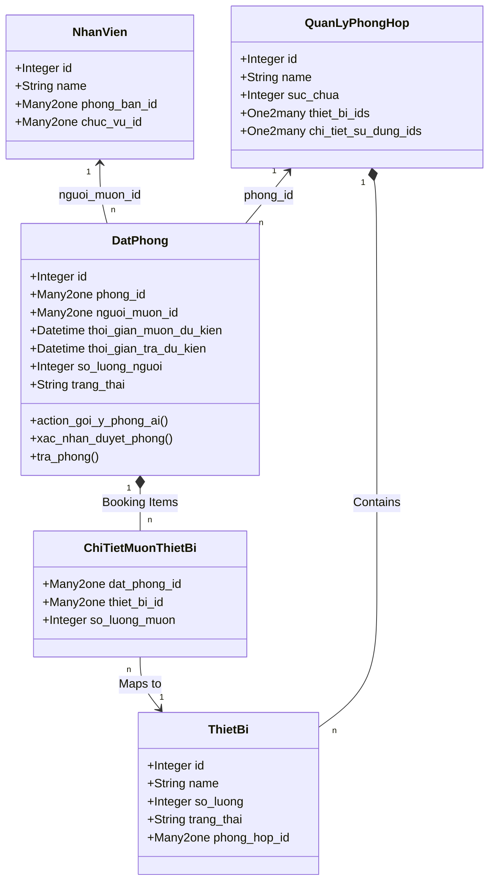
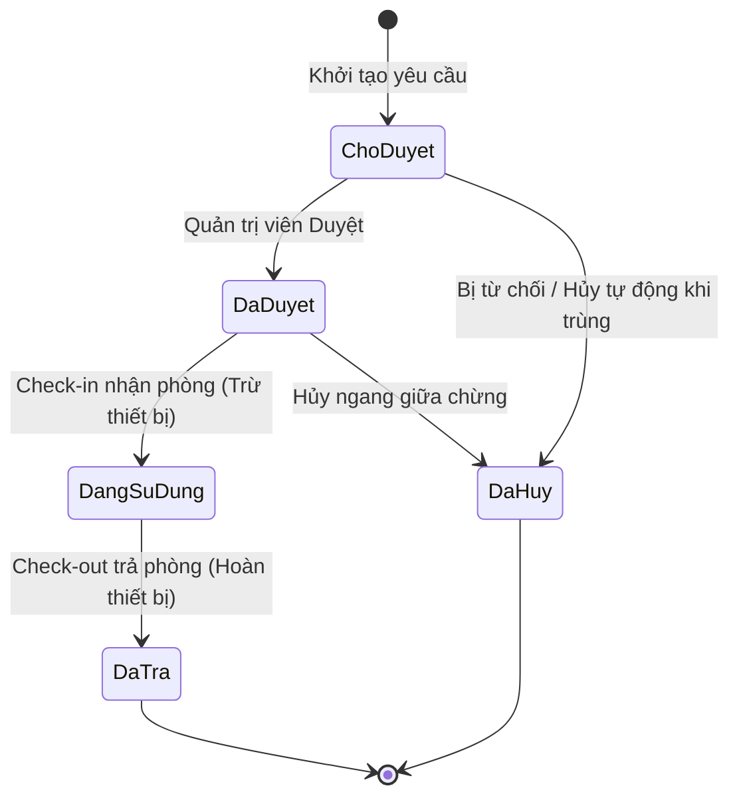

# BÁO CÁO BÀI TẬP LỚN
## Môn học: Hội nhập và Quản trị phần mềm Web / Doanh nghiệp

**Đề tài:** Phân tích, Thiết kế và Triển khai Phân hệ Quản lý Nhân sự và Quản lý Phòng họp Hội trường trên hệ thống ERP Odoo.

---

## CHƯƠNG 1: TỔNG QUAN VỀ ĐỀ TÀI VÀ HỆ THỐNG

### 1.1 Đặt vấn đề và Mục tiêu
Trong bối cảnh chuyển đổi số của các doanh nghiệp, việc số hóa các quy trình nội bộ như Quản lý hành chính nhân sự và Quản lý tài nguyên (thiết bị, phòng chức năng, phòng họp) là vô cùng cấp thiết. Việc quản lý thủ công thường dẫn đến các sai sót như: trùng lặp lịch họp, thiếu thiết bị hỗ trợ, khó kiểm soát nhân sự mượn/trả và không có cảnh báo theo thời gian thực.

Mục tiêu của đề tài là xây dựng hai phân hệ trên nền tảng ERP Odoo để giải quyết trọn vẹn bài toán này:
1. **Module `nhan_su`:** Đóng vai trò là Data Root (dữ liệu gốc) cung cấp thông tin trung tâm cho các hệ thống khác.
2. **Module `quan_li_phong_hop_hoi_truong`:** Sử dụng nguồn dữ liệu từ phân hệ nhân sự để tự động minh bạch hóa quá trình mượn, dùng và trả phòng họp.

### 1.2 Giới thiệu công nghệ
- **Hệ thống lõi:** Cấu trúc module Odoo (Python, XML, PostgreSQL).
- **Tích hợp:** Giao tiếp Extrenal API (Telegram Bot) để gửi thông báo tự động.
- **Tối ưu hóa Database:** Đánh chỉ mục (Indexing tốc độ cao) để đáp ứng thời gian thực cho truy vấn.

---

## CHƯƠNG 2: PHÂN TÍCH VÀ THIẾT KẾ HỆ THỐNG PHẦN MỀM

### 2.1 Sơ đồ lớp cơ sở dữ liệu (UML Class Diagram)

Các bảng dữ liệu được liên kết chặt chẽ thông qua hệ thống ORM (Object-Relational Mapping) của Odoo. `NhanVien` của Module Nhân sự đóng vai trò là cốt lõi cho mọi hành vi mượn/trả trong hệ thống Đặt phòng.



### 2.2 Sơ đồ trạng thái máy (State Machine - Vòng đời đặt phòng)



### 2.3 Thiết kế Logic Nghiệp vụ Cốt lõi (Mã nguồn)

Để đảm bảo dữ liệu luôn đúng đắn, ở tầng `Models` hệ thống thực thi các thuật toán Validate nghiêm ngặt thông qua Python Decorator `@api.constrains`.

**A. Thuật toán kiểm tra giới hạn sức chứa và dữ liệu âm:**
Thuật toán so sánh [so_luong_nguoi](file:///d:/Ky2nam3/H%E1%BB%99i%20nh%E1%BA%ADp%20v%C3%A0%20qu%E1%BA%A3n%20tr%E1%BB%8B%20ph%E1%BA%A7n%20m%E1%BB%81m%20doanh%20nghi%E1%BB%87p/HNQTPM-DN-1712/addons/quan_li_phong_hop_hoi_truong/models/dat_phong.py#34-41) mà người dùng nhập vào so với `suc_chua` thiết kế sẵn của `phong_id`. Nếu vượt quá, lập tức ném ra lỗi (Validation Error) yêu cầu chọn phòng lớn hơn.
```python
# File: addons/quan_li_phong_hop_hoi_truong/models/dat_phong.py
@api.constrains('so_luong_nguoi', 'phong_id')
def _check_so_luong_nguoi_hop_le(self):
    for record in self:
        # Chống nhập số người ảo (âm hoặc bằng 0)
        if record.so_luong_nguoi <= 0:
            raise ValidationError("❌ Số lượng người tham gia phải lớn hơn 0.")
            
        # Kiểm tra vượt trần sức chứa
        if record.phong_id and record.phong_id.suc_chua > 0 and record.so_luong_nguoi > record.phong_id.suc_chua:
            raise ValidationError(
                f"❌ Số lượng người ({record.so_luong_nguoi}) vượt quá sức chứa "
                f"của phòng '{record.phong_id.name}' (Tối đa {record.phong_id.suc_chua} người). "
                f"Vui lòng chọn phòng lớn hơn."
            )
```

**B. Thuật toán ngăn chặn đặt trùng lấp thời gian (Deadlock Prevention):**
Hệ thống lấy phòng hiện tại (qua `phong_id`) và quét (search) lại toàn bộ cơ sở dữ liệu để tìm các phiếu mượn chéo lấp thời gian. Nếu thời gian kết thúc của người dùng khai báo LỚN HƠN mốc lấy phòng của một người khấc, hoặc thời gian bắt đầu của người dùng NHỎ HƠN mốc trả phòng của người đó $\rightarrow$ Đã xảy ra trùng lịch.
```python
# File: addons/quan_li_phong_hop_hoi_truong/models/dat_phong.py
@api.constrains('phong_id', 'thoi_gian_muon_du_kien', 'thoi_gian_tra_du_kien')
def _check_trung_lich(self):
    for record in self:
        if record.phong_id and record.thoi_gian_muon_du_kien and record.thoi_gian_tra_du_kien:
            # Query chéo trục thời gian của phòng
            trung_lich = self.search([
                ('phong_id', '=', record.phong_id.id),
                ('id', '!=', record.id),
                # Chỉ check với phòng đang giữ chân
                ('trang_thai', 'in', ['đã_duyệt', 'đang_sử_dụng']),
                ('thoi_gian_muon_du_kien', '<', record.thoi_gian_tra_du_kien),
                ('thoi_gian_tra_du_kien', '>', record.thoi_gian_muon_du_kien)
            ])
            if trung_lich:
                raise ValidationError(f"⚠️ Lỗi: Phòng '{record.phong_id.name}' đã có người duyệt mượn hoặc đang sử dụng trong khoảng thời gian này! Vui lòng chọn giờ khác.")
```

---

## CHƯƠNG 3: CÀI ĐẶT ỨNG DỤNG VÀ KIỂM THỬ GIAO DIỆN

### 3.1 Cài đặt Logic Tự động hóa - AI Best Fit (Gợi ý phòng)
Hệ thống không chỉ dừng lại ở các CRUD (Thêm, Sửa, Xóa). Mà cung cấp một Nút bấm (Button) gợi ý phòng. Thuật toán hoạt động theo nguyên lý "Phòng trống có sức chứa nhỏ nhất nhưng vẫn vửa đủ nhu cầu".

```python
# Cài đặt tại action_goi_y_phong_ai() 
# Bước 1: Lọc phòng đủ sức chứa đáp ứng
phong_phu_hop = self.env['quan_ly_phong_hop'].search([('suc_chua', '>=', record.so_luong_nguoi)])

# Bước 2: Duyệt từng phòng, loại đi những phòng đang kẹt lịch trong Database
phong_trong = []
for phong in phong_phu_hop:
    trung_lich = self.env['dat_phong'].search([
        ('phong_id', '=', phong.id),
        ('trang_thai', 'in', ['đã_duyệt', 'đang_sử_dụng']),
        ('thoi_gian_muon_du_kien', '<', record.thoi_gian_tra_du_kien),
        ('thoi_gian_tra_du_kien', '>', record.thoi_gian_muon_du_kien)
    ])
    if not trung_lich:
        phong_trong.append(phong)

# Bước 3: Thuật toán AI "Best Fit": Chọn phòng NHỎ NHẤT nhưng VẪN ĐỦ CHỖ để tiết kiệm điện điều hòa, quy mô mượn.
phong_trong.sort(key=lambda p: p.suc_chua)
phong_chon = phong_trong[0]

# Gán tự động vào màn hình Odoo
record.phong_id = phong_chon.id
```

### 3.2 Cài đặt thông báo liên kết Webhook (Telegram API)
Khi các trạng thái phòng nhảy sang "Đã duyệt", HTTP request của API Telegram sẽ được triệu gọi bằng thư viện `requests` nhằm mục đích "nhắn tin" ngay lập tức cho bộ phận quản trị hoặc lễ tân qua nền tảng liên lạc.

```python
def _send_telegram_notification(self, message):
    BOT_TOKEN = "xxx_TOKEN_CỦA_BOT"
    CHAT_ID = "xxx_MÃ_NHEN"     
    url = f"https://api.telegram.org/bot{BOT_TOKEN}/sendMessage"
    payload = {
        "chat_id": CHAT_ID,
        "text": message,
        "parse_mode": "Markdown"
    }
    try:
        # Gửi tín hiệu JSON API qua Server Telegram (Giới hạn timeout 5s để Odoo không bị đơ)
        response = requests.post(url, json=payload, timeout=5)
        response.raise_for_status()
    except requests.exceptions.RequestException as e:
        # Ghi log ẩn thay vì báo lỗi popup để không làm gián đoạn trải nghiệm người dùng Odoo
        pass
```


### 3.3 Một số giao diện tiêu biểu và Kết quả kiểm thử (Testing)

_Ghi chú: [Hãy copy/chụp các hình dán vào vị trí text trong ngoặc dưới đây vô Word trước khi nộp]_

**1. Giao diện Đặt phòng thực tế (Form View)**
* Hệ thống hiển thị biểu mẫu rõ ràng, thông tin người mượn tự động tham chiếu từ bảng nhân sự. Có khu vực chọn thiết bị đi kèm (chạy dưới dạng One2Many lines).
* *[Hình 1: Chèn ảnh Giao diện chức năng "Đăng ký mượn phòng" trên hệ thống ERP Odoo tại đây]*

**2. Giao diện Danh sách quản lý, Kanban & Grid**
* Chế độ xem mạng lưới (Kanban) với các màu sắc (Badge) thể hiện Trạng thái "Đang dùng", "Bị hủy", "Chờ duyệt". 
* *[Hình 2: Chèn ảnh Giao diện Danh sách Kanban Đặt phòng tại đây]*

**3. Kết quả bật Lỗi Cảnh báo khắt khe của hệ thống**
* **Trường hợp lỗi trùng lịch**: Khi có một người khác cố tình đặt đè thời gian lên lịch đã duyệt. Odoo báo Pop-up đỏ tức thì cản lại.
* *[Hình 3: Chụp ảnh hộp thoại báo lỗi màu đỏ "⚠️ Lỗi: Phòng đã có người duyệt mượn..."]*
* **Trường hợp lỗi tràn sức chứa**: Khi đặt phòng 5 chỗ cho đoàn 10 người.
* *[Hình 4: Chụp ảnh báo lỗi Popup "❌ Số lượng người vượt quá sức chứa của phòng..."]*

**4. Kết quả nhận tin nhắn báo về từ Telegram Bot**
* Điện thoại báo notification tin nhắn Markdown đẹp của Telegram báo là phòng đã được duyệt.
* *[Hình 5: Chèn ảnh chụp tin nhắn Telegram Bot trả về chữ có dấu Tích xanh / Thất bại xịt đỏ hiển thị giờ Việt Nam]*

---
**TỔNG KẾT VÀ ỨNG DỤNG**
Phân hệ Quản lý Nhân lực kết hợp Quản lý Phòng họp là bức tranh hoàn chỉnh của quá trình tích hợp module trong Doanh nghiệp trên nền tảng Odoo. Các dòng code xử lý chặt chẽ Constraint, kết hợp UI tự động cập nhật Inventory (Thiết bị) khiến bộ máy nhân sự có thể rút gọn đi rất nhiều các khâu xin-kí-phê giấy tờ truyền thống. Đặc biệt là thông báo đẩy Telegram chứng minh tính "Kết nối tức thời" của Odoo với phần mềm thứ 3.
